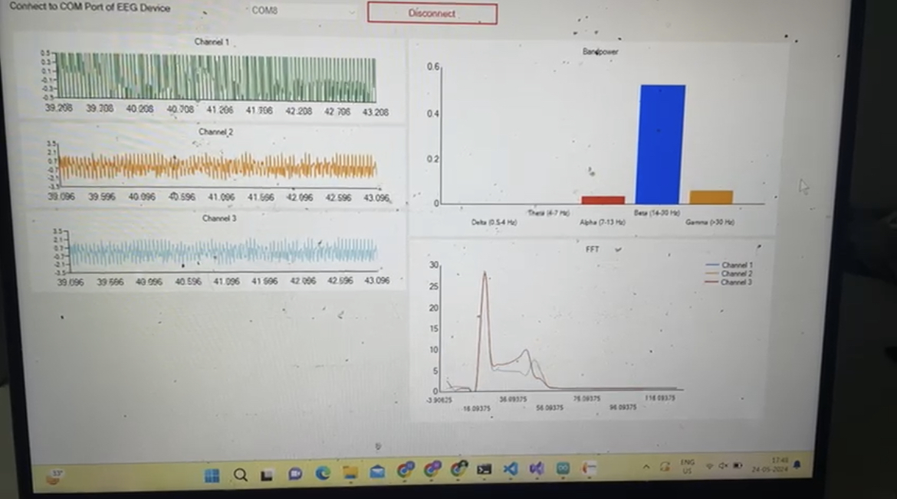

# ECG Acquizition and Visualization System
This is a ECG Acquizition system based on ESP32 and AD8232. The acquired signals are transmitted to the host system where the software in the GUI can be used for vizualization and signal processing

## Steps to setup:
- Compile and flash ESP32 with the acq.ino file.
- Run the GUI software and see the results!

